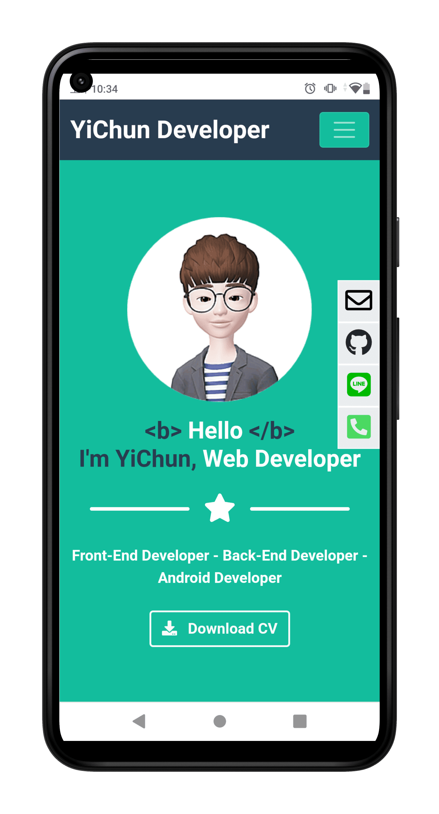

# CV

Hello, my name is 王逸竣（Yi-Chun Wang）, a web developer. This is my personal website. It mentions my education and work experience, the projects I have participated in, etc.

 

## Live Demo

🔗 [My Website](https://january07.github.io/resume)

## Requirements

* Node 19
* Git
* Vue 3 + Typescript + Vite

## Common setup

Clone the repo and install the dependencies.

```bash
git clone https://github.com/January07/resume.git
```

Open IDE and create a new project from the just downloaded source.

## Install

This project uses [node](https://nodejs.org/) and [npm](https://www.npmjs.com/). Go check them out if you don't have them locally installed.

```bash
$ npm install
$ npm run dev
```

Open http://127.0.0.1:5173/resume and take a look around.